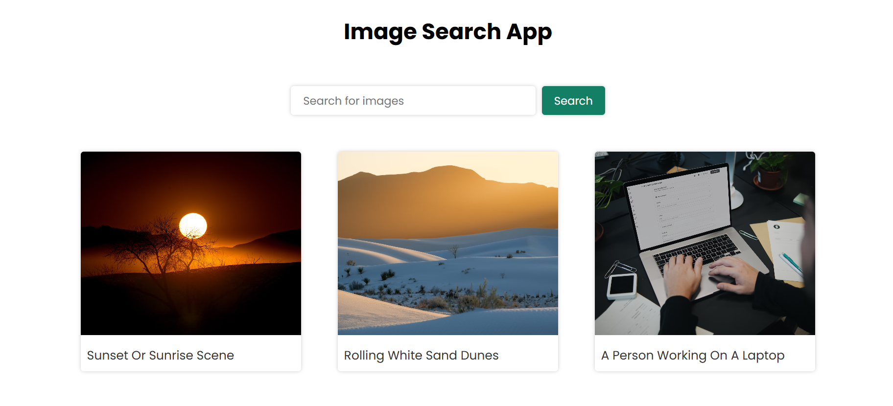

# 🚀 Image Search App using Unsplash API 🌟

Excited to share my latest project—a simple yet powerful **Image Search App**! 🔍✨  

## 🖼️ Preview  
  

## 🔗 Live Demo  
👉 [Try it here](https://chaitu1277.github.io/Image-Search-App/)  

## 🔹 Tech Stack  
✅ HTML, CSS, JavaScript  
✅ Unsplash API for fetching high-quality images  

## 🎯 Features  
- 🔍 **Search Functionality:** Users can enter any keyword, and the app fetches relevant images.  
- 🎨 **Responsive UI:** Clean and modern design for an optimal user experience.  
- ⚡ **Fast Image Retrieval:** Efficient API calls for seamless browsing.  
- 💾 **Dynamic Rendering:** Images are displayed dynamically based on search queries.  

## 🖼️ About Unsplash API  
Unsplash is one of the largest free image repositories, offering high-resolution photos from photographers worldwide. The **Unsplash API** allows developers to access and integrate these images into their applications effortlessly.  
